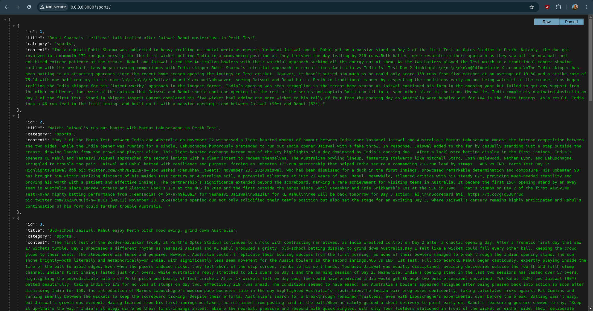

# News Scrapper Api

A powerfull Python script made using BeautifulSoup library and feedparser.

It's Workflow looks something like this:


## Documentation

To set up the tool/script, Do the Installation and Environement Vairable Section.


## Installation

We highly recommend you have Docker setup on your Linux/Mac/Windows, because it is better to use it over with 
Docker to see all the Logs and process happening at one place. 

The following setup will also use DockerFile and Docker-Compose.

First, Git clone the repo to your local.

```bash
  git clone https://github.com/YashRaj1506/News_API
```

Now we will build the images with Docker and run it with the following commands

```bash
  docker-compose build 
```

```bash
  docker-compose up
```
    
## Environment Variables

Create a file called .env in the root directory.

To run this project, you will need to add the following environment variables to your `.env` file

We have added some by default values, so that you can understand what to fill it with. 
You are free to change the values according to your system.


```bash
POSTGRES_USER=postgres 
POSTGRES_PASSWORD=postgres
POSTGRES_DB=postgres
POSTGRES_DOCKER_HOST=postgres
POSTGRES_PORT=5432

REDIS_URL=redis://redis_cache:6379/0
CELERY_BROKER_URL=redis://redis_cache:6379/0

SECRET_KEY= 'djangojajajjssd56531315vd1v5d'

SUPERUSER_NAME=dummy
SUPERUSER_EMAIL=dummy@gmail.com
SUPERUSER_PASSWORD=dummy
```


## How to Use the tool by customizing it

So now that you have setup the tool on your system, following text will explain you how can 
you customize the schedule/timings of the program

Go to the file `celery.py` inside directory `news/news`

inside the follwing code, there are two options, 

`option 1` represent a repetetive task, means if */5 is written the process will keep repeating every 5 minutes, updating the API's and db with fresh news data.

`option 2` represent a single task, means at single hour and minute of the day it will do the following task once in a day.
```bash
app.conf.beat_schedule = {
    'scrape data again every 15 min' : {
        'task': 'api.tasks.test_func',
        'schedule': crontab('*/5'), #1st option
        # 'schedule': crontab(hour= 12, minute=45), #2nd option

    }
}
```

Now if you have made changes, run the docker commands again. Build the images and run the conatiner with compose, by following commands:

```bash
  docker-compose build 
```

```bash
  docker-compose up
```

And KABOOM!! It will work now!!

## Viewing API's

After you have done all the things mentioned above, Go to your browser and hit the url

`0.0.0.0:8000`

First thing you will see will look something like this:


If you click on Sports News, you will be redirected to the respected API which was build



## More Info

Hey Everyone, Thank you for going through the Doc, This is the first version of the release and it needs a lot of Improvements and more optimal solutions, and hence as a open source initiative i welcome you all to work on this project. I will list and open the issues soon. Thank you!!

FUN FACT: This project's first version is being released after 4 days of work HAHA.
